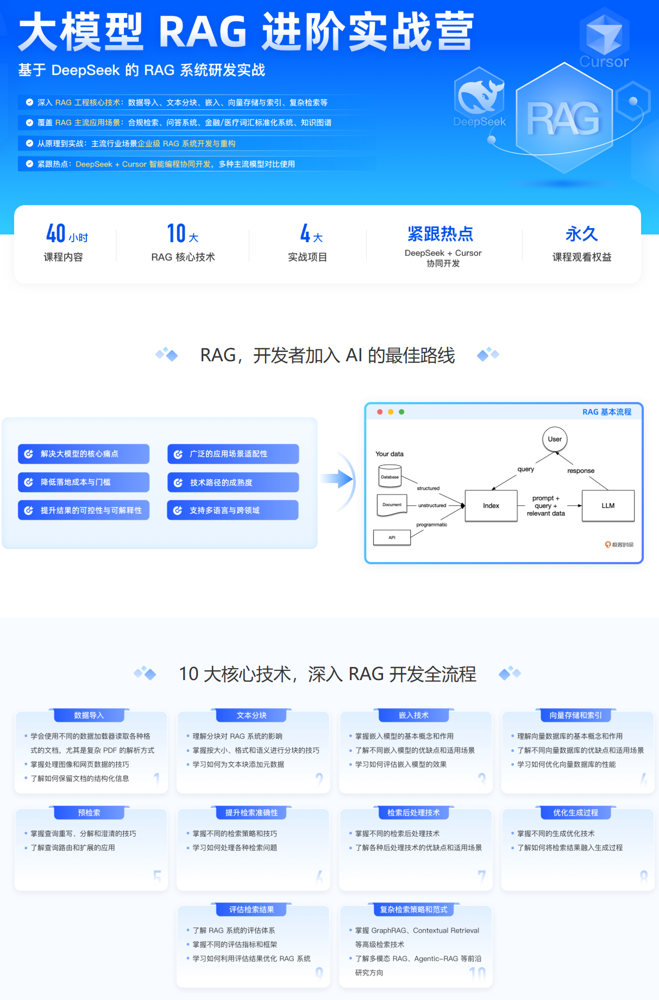
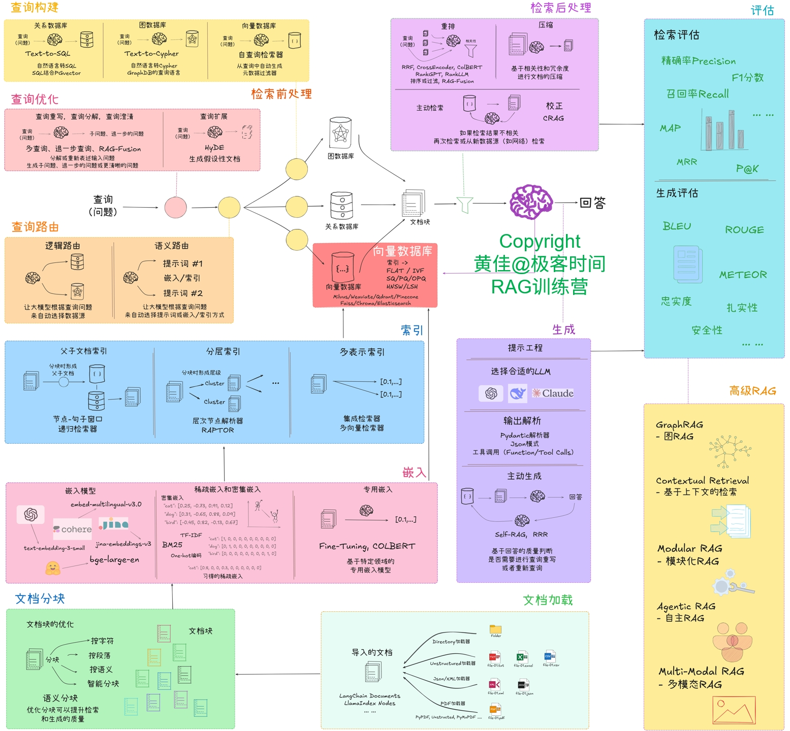

# RAG (Retrieval-Augmented Generation) System Development in Practice

This project is the code repository for a DeepSeek-based RAG system [practical course](https://u.geekbang.org/subject/airag/1009927), implementing a complete Retrieval-Augmented Generation system.

Course link: [RAG System Development in Practice](https://u.geekbang.org/subject/airag/1009927)



> **Advanced LLM RAG Bootcamp** — Hands-on RAG System Development with DeepSeek
>
> | | |
> |---|---|
> | **40 hrs** course content | **10** core RAG skills |
> | **4** real-world projects | Trending topics: DeepSeek + Cursor |
> | Lifetime access to materials | |
>
> *RAG is the best on-ramp for developers entering AI — covering 10 core technologies across the full RAG development workflow.*


## Technology Framework



> The diagram above (in Chinese) shows the complete RAG technology landscape. The English description of each section follows below.

### Document Loading
- **LangChain Documents / LlamaIndex Nodes**
- Supported parsers: PyPDF, Unstructured, PyMuPDF, JSON/XML loaders, web loaders

### Document Chunking
- **Chunking strategies**: by character, paragraph, heading, or intelligent split
- **Semantic chunking**: optimizes chunk boundaries for retrieval quality and generation coherence

### Embedding
- **Dense embedding models**: `embed-multilingual-v3.0` (Cohere), `jina-embeddings-v3`, `text-embedding-3-small`, `bge-large-en`
- **Sparse / hybrid embedding**: TF-IDF, BM25, one-hot, sparse vectors
- **Specialized embedding**: Fine-tuning, ColBERT

### Vector Database
- **Dense vector indexes**: FLAT, IVF, HNSW/LSH
- **Relational database** for structured metadata

### Indexing
| Index Type | Technique |
|---|---|
| Small-to-large context | Node sentence window, sliding window retriever |
| Hierarchical | Cluster-based indexing, RAPTOR |
| Multi-representation | Ensemble retriever, multi-vector retriever |

### Query Construction
| Technique | Description |
|---|---|
| Text-to-SQL | Natural language → SQL (SQL2Pinecot) |
| Text-to-Cypher | Natural language → Cypher (GraphDB/GPT queries) |
| Self-query retriever | Automatically constructs structured filters from the query |

### Pre-Retrieval Processing
- **Query rewriting / decomposition / filtering**
- **Multi-query**: generates multiple sub-queries, step-by-step decomposition, RAG-Fusion
- **HyDE** (Hypothetical Document Embeddings): generates a hypothetical answer to improve retrieval

### Query Routing
- **Logic routing**: rule-based routing to different data sources
- **Semantic routing**: LLM-based routing using prompt #1 / prompt #2 to select the appropriate retrieval method

### Post-Retrieval Processing
- **Reranking**: RRF, CrossEncoder, ColBERT, RankGPT, RankLLM, RAG-Fusion — based on keyword + semantic scores, with text compression
- **Active checking (CRAG)**: if retrieval results are unsatisfactory, re-searches across multiple data sources

### Generation
- **Prompt engineering**: select appropriate LLM (e.g. DeepSeek, Claude, GPT-4)
- **Output parsing**: Pydantic parser, JSON parser, tool/function calling
- **Active generation**: Self-RAG, RRR — decides whether to regenerate or retry based on retrieval quality

### Evaluation
| Dimension | Metrics |
|---|---|
| Retrieval evaluation | Precision, F1, Recall, MAP, MRR, P@K |
| Generation evaluation | BLEU, ROUGE, METEOR, Faithfulness, Factuality, Safety |

### Advanced RAG
| Technique | Description |
|---|---|
| **GraphRAG** | Graph-based RAG for multi-hop reasoning |
| **Contextual Retrieval** | Augments each chunk with document-level context before indexing |
| **Modular RAG** | Plug-and-play modular RAG architecture |
| **Agentic RAG** | Self-directed RAG with autonomous agent loops |
| **Multi-Modal RAG** | RAG over images, audio, and video |


> The companion book [*RAG in Action*](https://item.jd.com/14447967.html) has been published! (Posts & Telecom Press)

[Click here to purchase at a discount](https://item.jd.com/14447967.html)

## Project Architecture

The project uses a modular design, with each module responsible for a different aspect of the RAG system:

| Module | Function | Tech Stack | Dependencies |
|--------|----------|------------|--------------|
| `00-SimpleRAG` | Basic RAG system implementation | LangChain/LlamaIndex | Base environment |
| `01-DataLoading` | Data loading and preprocessing | pandas, PyPDF2 | Document parsing libraries |
| `02-DocChunking` | Document chunking strategies | LangChain Splitters | NLP tools |
| `03-Embedding` | Text vectorization | HuggingFace, BGE | GPU support (optional) |
| `04-VectorDB` | Vector database operations | Milvus, Chroma | Vector database |
| `05-PreRetrieval` | Retrieval optimization | Query Expansion | NLP tools |
| `06-Indexing` | Index construction and optimization | Hierarchical index, Keyword index | Search engine |
| `07-PostRetrieval` | Retrieval result optimization | Reranking, Filtering | ML models |
| `08-Generation` | Answer generation | LLM integration | GPU recommended |
| `09-Evaluation` | System performance evaluation | RAGAS, TruLens | Evaluation frameworks |
| `10-AdvanceRAG` | Advanced RAG technique implementation | Graph RAG, Multi-Agent | Advanced frameworks |

## Environment Requirements

### Hardware Requirements

#### GPU Version
- NVIDIA GPU (recommended >= 8GB VRAM)
- CUDA 11.8 or higher
- cuDNN 8.0 or higher

#### CPU Version
- Recommended >= 16GB RAM
- Multi-core processor (recommended >= 4 cores)

### Software Requirements

#### Operating System Support
1. **Ubuntu** — Recommended: 22.04 LTS
2. **MacOS (Intel/Apple Silicon)** — Apple Silicon can use MPS acceleration
3. **Windows 10/11** — Recommended: WSL2 + Ubuntu

### Framework Selection

1. Python: 3.10+
2. LangChain Framework
   - Basic version: `requirements_langchain_SimpleRAG(additional-packages-needed-for-later-modules).txt`
   - Full version (GPU): `requirements_langchain_20250413(Ubuntu-with-GPU).txt`
   - Full version (CPU): `requirements_langchain_no-GPU(Mac,Win).txt`

3. LlamaIndex Framework
   - Basic version: `requirements_llamaindex_SimpleRAG(additional-packages-needed-for-later-modules).txt`
   - Full version (GPU): `requirements_llamaindex_20250413(Ubuntu-with-GPU).txt`
   - Full version (CPU): `requirements_llamaindex_no-GPU(Mac,Win).txt`

## Environment Setup

### Ubuntu (GPU Version + LangChain Framework)

```bash
# Create virtual environment
python -m venv venv-rag-langchain
source venv-rag-langchain/bin/activate
## Or use conda
conda create -n venv-rag-langchain python=3.10.12
conda activate venv-rag-langchain

# Install dependencies
pip install -r 91-Environment/requirements_langchain_20250413_Ubuntu-with-GPU.txt
```

### Ubuntu (CPU Version + LangChain Framework)

```bash
# Create virtual environment
python -m venv venv-rag-langchain
source venv-rag-langchain/bin/activate
## Or use conda
conda create -n venv-rag-langchain python=3.10.12
conda activate venv-rag-langchain

# Install dependencies
pip install -r 91-Environment/requirements_langchain_Ubuntu-with-CPU.txt
```

### MacOS/Windows (CPU Version + LangChain Framework)

```bash
# Create virtual environment
python -m venv venv-rag-langchain
# Windows
.\venv-rag-langchain\Scripts\activate
# MacOS
source venv-rag-langchain/bin/activate
## Or use conda
conda create -n venv-rag-langchain python=3.10.12
conda activate venv-rag-langchain

# Install dependencies
pip install -r 91-Environment/requirements_langchain_no-gpu_Mac-Win.txt
```

### Ubuntu (GPU Version + LlamaIndex Framework)

```bash
# Create virtual environment
python -m venv venv-rag-llamaindex
source venv-rag-llamaindex/bin/activate
## Or use conda
conda create -n venv-rag-llamaindex python=3.10.12
conda activate venv-rag-llamaindex

# Install dependencies
pip install -r 91-Environment/requirements_llamaindex_20250413_Ubuntu-with-GPU.txt
```

### Ubuntu (CPU Version + LlamaIndex Framework)

```bash
# Create virtual environment
python -m venv venv-rag-llamaindex
source venv-rag-llamaindex/bin/activate
## Or use conda
conda create -n venv-rag-llamaindex python=3.10.12
conda activate venv-rag-llamaindex

# Install dependencies
pip install -r 91-Environment/requirements_llamaindex_Ubuntu-with-CPU.txt
```

### MacOS/Windows (CPU Version + LlamaIndex Framework)

```bash
# Create virtual environment
python -m venv venv-rag-llamaindex
# Windows
.\venv-rag-llamaindex\Scripts\activate
# MacOS
source venv-rag-llamaindex/bin/activate
## Or use conda
conda create -n venv-rag-llamaindex python=3.10.12
conda activate venv-rag-llamaindex

# Install dependencies
pip install -r 91-Environment/requirements_llamaindex_no-gpu_Mac-Win.txt
```

## Special Dependency Notes

1. **PDF processing:**
   - Use `requirements_camelot_20250413.txt` to install PDF processing dependencies
   - May require additional system-level dependencies:
     - Ubuntu: `sudo apt-get install ghostscript python3-tk`
     - MacOS: `brew install ghostscript tcl-tk`
     - Windows: Ghostscript must be installed manually

2. **Annotation tools:**
   - Use `requirements_marker_20250413.txt` to install annotation tool dependencies

## Usage Instructions

1. Select the appropriate environment configuration file and install dependencies
2. Learn and practice the modules in order
3. Each module contains independent examples and documentation
4. It is recommended to start with `00-SimpleRAG` and progress gradually

## Notes

1. The GPU version requires that the CUDA environment is configured correctly
2. Different operating systems may require additional system-level dependencies
3. It is recommended to use a virtual environment to manage dependencies
4. Some modules may require additional model downloads or API key configuration

## Frequently Asked Questions

1. **CUDA-related errors**: check that the NVIDIA driver and CUDA versions are compatible
2. **Insufficient memory**: adjust batch size or use the CPU version
3. **Dependency conflicts**: use a virtual environment and install strictly according to the requirements file

## Contribution Guide

Issues and Pull Requests are welcome to help improve the project.

[](https://www.star-history.com/#huangjia2019/langchain-in-action&huangjia2019/ai-agents&huangjia2019/let-us-machine-learning&huangjia2019/rag-in-action&huangjia2019/llm-gpt&Date)

## License

This project is licensed under the MIT License.
